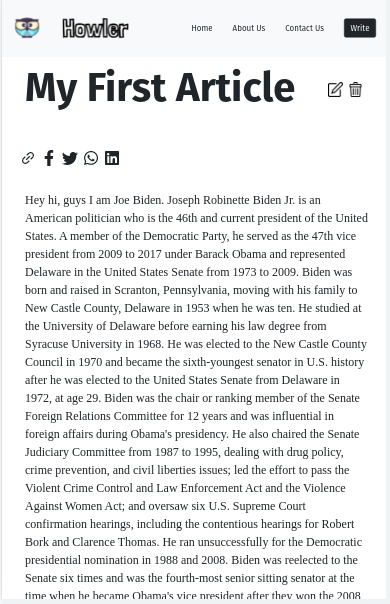

# UttarBlog

It is a blogging webapp allowing is users to express themselves out in the world :p.

## Tech Stack

- React JS
- Node JS
- MongoDB

## Features

- **Create new blogs** - Users are able to create and add new blogs
- **Update existing blogs** - Users are able to update their written blogs.
- **Create existing blogs** - Users can also delete the written blogs.

## Snippets

#### Homepage

#### Article Page

#### Write a new blog

#### Update a existing blog

#### Mobile View

